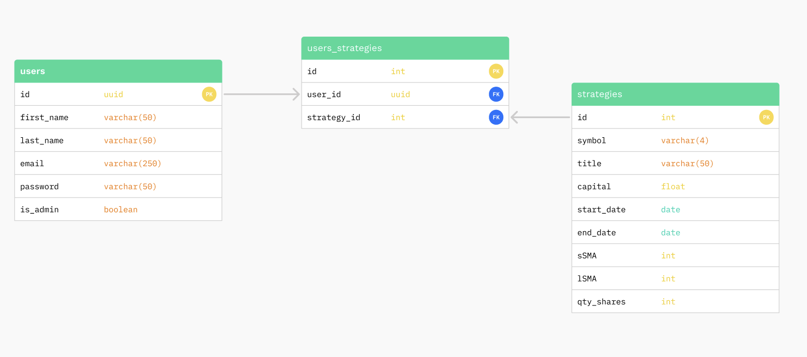

# Backend Development for AlgoBeez

This is the backend development for AlgoBeez, an algorithmic trading backtesting application.

## Installation

1. Clone the repository: git clone https://github.com/chen-shujun23/Algotrading-Backtesting-Backend
2. Install dependencies:

- npm install
- npm i bcrypt cors dotenv express express-validator jsonwebtoken pg pg-hstore sequelize uuid
- npm install -D nodemon sequelize-cli

3. Start the development server: npm start
4. Open http://localhost:5001 or any other port that you have configured to view it in the browser.
5. Create an env file with the following configuration:

```javascript
PORT = 5001;
DB_DATABASE = algobeez;
DB_USERNAME = your_username;
DB_PASSWORD = your_password;
DB_HOST = localhost;
DB_DIALECT = postgres;
NODE_ENV = development;
ACCESS_SECRET = your_access_secret;
REFRESH_SECRET = your_refresh_secret;
```

## Usage

This repository should run concurrently with the frontend server for the user interface. You may clone the frontend development repository from https://github.com/chen-shujun23/Algotrading-Backtesting-Frontend

## Technologies

This project uses the following technologies:

- HTML, CSS, Javascript
- TailwindCSS: a utility-first CSS framework
- **P**ostgresSQL: a SQL database used to store and retrieve data
- **E**xpress: a backend web framework for Node.js
- **R**eact: a frontend JavaScript library for building user interfaces
- **N**ode.js: a JavaScript runtime environment for server-side development

## Database Relationship



## Backend Approach

This project uses Sequelize as an ORM. Sequelize CLI is a command-line interface for Sequelize, an ORM for Node.js that supports various databases such as PostgreSQL, MySQL, SQLite, and MSSQL. The CLI makes it easier to manage Sequelize projects by providing a set of commands that help you generate models, migrations, and seed files, as well as perform database operations like creating and dropping databases, running migrations, and seeding data.

## Unsolved Problems & Further Work

- Create more endpoints for features, such as search for strategies.
